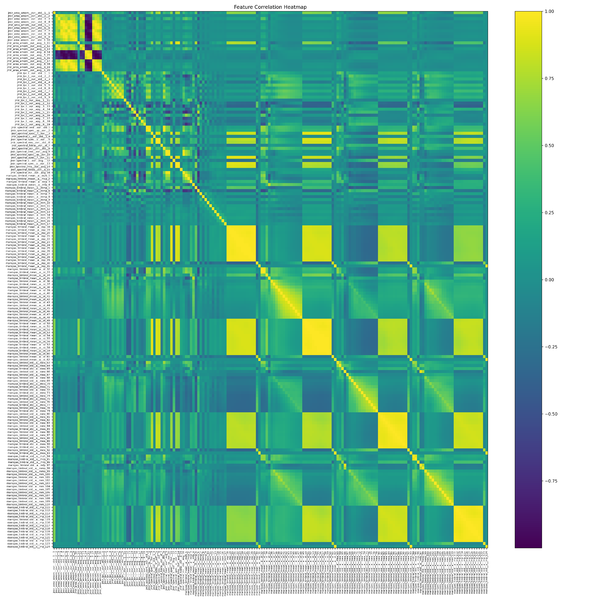
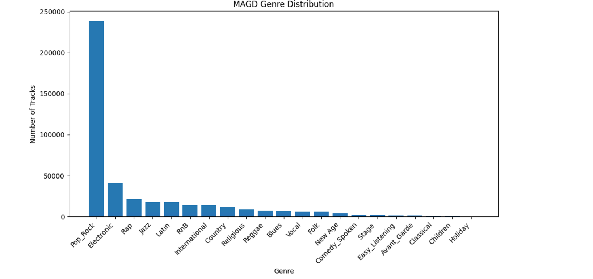

# Million Song Dataset Analysis with Spark

A reproducible PySpark implementation of the submitted Million Song Dataset assignment. The project separates two workflows:

- audio-feature genre classification with logistic regression, random forest, or gradient-boosted trees;
- implicit-feedback song recommendations using Spark ALS.

The original report informed the project structure and selected visuals, but is not included. The large source datasets and Azure credentials are intentionally not committed.

## Selected report visuals



*Correlation heatmap used to identify redundant audio features before modelling.*



*The genre imbalance that motivates balancing before binary classification.*

## Layout

```text
src/msd_pipeline.py   Spark command-line workflows
src/metrics.py        Pure-Python ranking metrics used in tests
data/README.md        Expected input data and responsible data handling
tests/                Unit tests for ranking metrics
assets/               Selected visuals from the submitted analysis
```

## Setup

```bash
python -m venv .venv
. .venv/bin/activate                 # Windows: .venv\Scripts\activate
pip install -r requirements.txt
```

Download the Million Song Dataset / course-provided extracts separately, then configure Spark to reach your local, HDFS, or cloud paths.

## Commands

```bash
# Inspect audio schema constructed from its attributes file
spark-submit src/msd_pipeline.py audio-schema \
  --attributes /data/audio/attributes/msd-jmir-mfcc-all-v1.0.attributes \
  --features /data/audio/features/msd-jmir-mfcc-all-v1.0

# Train and evaluate a binary genre classifier
spark-submit src/msd_pipeline.py train-genre \
  --audio /data/audio/features/combined.parquet \
  --genres /data/genre/msd-MAGD-genreAssignment.tsv \
  --positive-genre Pop_Rock --model gbt --output output/genre_gbt

# Filter interactions, make a per-user 80/20 split, and train implicit ALS
spark-submit src/msd_pipeline.py train-als \
  --triplets /data/tasteprofile/triplets.tsv --output output/als
```

## Reproducibility choices

- The attributes CSV drives explicit Spark schemas; feature files are not inferred.
- Binary classifiers use a deterministic random seed and save their fitted Spark pipeline.
- ALS splitting is performed within each user, so every test user also appears in training.
- The recommendation workflow removes sparse users and songs before factorisation. Tune the thresholds to your experiment rather than treating the report's values as universal.
- Inputs, model checkpoints, and output directories are gitignored.

The code provides the pipeline; it does not claim that results will exactly reproduce the report without the same source snapshot, cluster configuration, preprocessing, and random seed.
